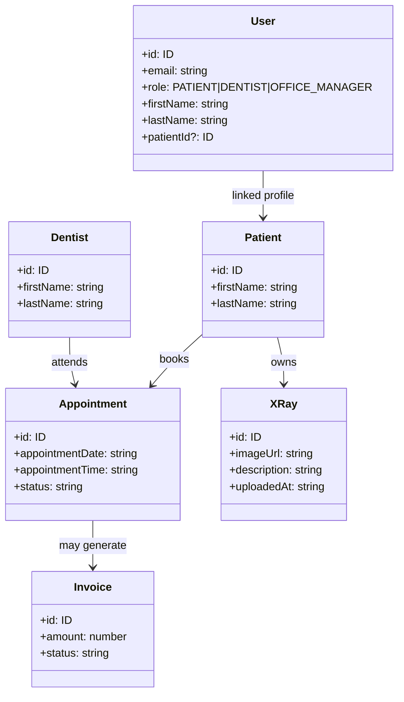
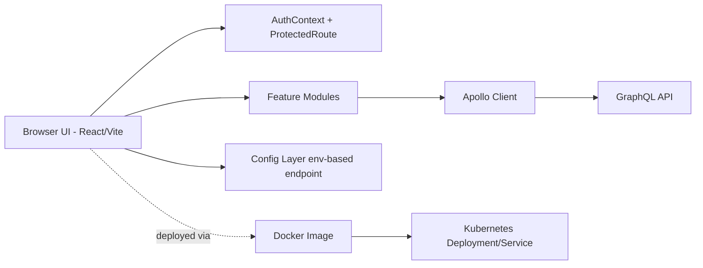
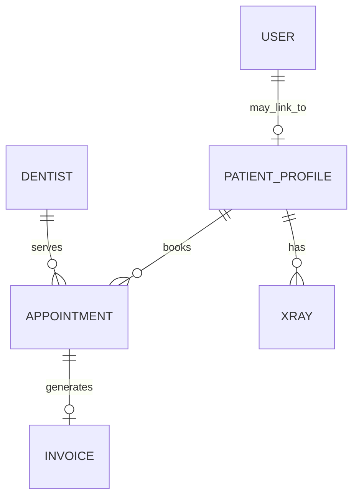

# ADS Dental Clinic Frontend

A production-oriented frontend for a dental clinic management system, built with React, TypeScript, GraphQL, and containerized deployment support.

---

## Project Overview

This frontend addresses the operational and user-experience challenges of a modern dental clinic by providing role-based interfaces for:

- Patients
- Dentists
- Office managers

The application focuses on secure access, clear navigation, actionable dashboards, and modular feature delivery for appointments, records, billing, analytics, and administration.

---

## Problem Statement

Dental clinic workflows are often fragmented across calls, paper records, and disconnected tools.  
This project solves that by offering a unified web application where different stakeholders can:

- Book and track appointments
- Access and manage records (including X-rays)
- Coordinate billing and administrative actions
- Monitor operational insights through dashboards

---

## Solution Scope (Frontend)

This repository covers frontend concerns only:

- UI/UX and role-based navigation
- Client-side GraphQL integration
- Authentication state management
- Feature modules and routing
- Testing setup for component/unit flows
- Containerization and Kubernetes deployment manifests

Backend internals (DTO implementation, persistence rules, API internals) are intentionally outside this repository’s scope.

---

## Enterprise Solution Design & Technology

### Core stack

- **React + TypeScript**
- **Vite** build tooling
- **Apollo Client** for GraphQL communication
- **React Router** for protected and modular routing
- **Jest** setup for testing
- **Docker** for containerized frontend delivery
- **Kubernetes** manifest for deployment (`frontend-k8s.yaml`)

### Architecture goals

- Clear role boundaries in UI
- Feature-based modularity for maintainability
- Environment-driven configuration
- Deployment-ready artifact path from local dev to cluster

---

## Design Approach

The implementation follows a **modular, feature-first architecture** where each business capability owns its pages, GraphQL documents, and UI elements.  
Cross-cutting concerns (auth, config, routing, layout, client setup) are centralized in dedicated folders.

### Folder structure (high level)

```text
src/
  components/          # shared reusable UI
  config/              # environment config (GraphQL endpoint, app config)
  context/             # global providers (AuthContext)
  features/            # business modules
    appointments/
    auth/
    billing/
    dentists/
    patients/
    surgery/
    analytics/
  graphql/             # shared Apollo client setup
  layouts/             # dashboard shell/layout composition
  pages/               # generic pages (e.g., Home)
  routes/              # route definitions and guards
  utils/               # helper utilities
```

---

## Design Patterns Used

- **Provider Pattern**  
  `AuthContext` provides global authentication state and user identity mapping.

- **Route Guard Pattern**  
  `ProtectedRoute` enforces access boundaries by role and auth state.

- **Feature Module Pattern**  
  Each domain area (appointments, billing, patients, etc.) encapsulates its own GraphQL and pages.

- **Container / Presentational Separation (practical form)**  
  Pages own data fetching and orchestration, while components focus on rendering/reuse.

- **Configuration Pattern**  
  Runtime settings are pulled from environment variables (`src/config/index.ts`).

---

## Functional Coverage & User Experience

### Patient experience

- Dashboard with health and appointment context
- Medical records and X-ray history
- Appointment booking flow

### Dentist & staff experience

- Patient list and treatment-facing screens
- X-ray upload and management views
- Clinical operations interfaces

### Office manager/admin experience

- Centralized appointment management
- Billing and invoice actions
- Surgery and staff management pages
- Operational analytics view

### UX principles applied

- Role-focused navigation
- Fast scanability (cards, tables, segmented sections)
- Action-first screen hierarchy
- Loading/error state handling per GraphQL operation

---

## Requirements and Use Cases

### Key use cases

1. User signs in and is routed to role-appropriate dashboard.
2. Patient books appointment with dentist and surgery details.
3. Patient views records and uploaded X-rays.
4. Admin manages appointments and billing from one operational view.
5. Staff manages surgeries, dentists, and clinic-related entities.

### Functional requirements

- Role-based route protection
- GraphQL data fetch/mutation integration
- Persistent auth session in browser storage
- Search/filter flows in management tables
- Build and run via local, container, and Kubernetes setups

### Non-functional requirements

- Modularity and maintainability
- Environment portability
- Predictable loading/error UI behavior
- Testable codebase structure

---

## Analysis/Design Artifacts

## Domain model (frontend-facing conceptual model)



## High-level architecture



## Data model view (consumed entities)



---

## Security and Authentication (Frontend)

- Role-aware route protection through guarded routes
- Session persistence through token + user state in local storage
- UI-level authorization boundaries for patient/dentist/admin pages
- GraphQL request routing through configured endpoint with auth-aware client setup

---

## Testing Strategy

Testing is configured via:

- `jest.config.js`
- `jest.setup.ts`

### Unit testing focus

- Component rendering logic
- Utility/helper behavior
- Conditional role-based UI and guards

### Integration testing focus

- Page-level flows with mocked GraphQL responses
- Form submission + mutation lifecycle states
- Route protection behavior

---

## Deployment and Delivery

### Containerization

- `Dockerfile` builds and serves the frontend artifact.

### Kubernetes deployment

- `frontend-k8s.yaml` defines:
  - Deployment (`frontend-deployment`)
  - Service (`ads-dental-frontend-service`, NodePort)

### Runtime configuration

- `src/config/index.ts` uses environment variable fallback for GraphQL endpoint.

---

## Git/GitHub Implementation Practice

The project follows modular commits and repository-based collaboration with clear separation between:

- core setup
- auth/routing
- feature modules
- deployment artifacts

Recommended commit style: conventional commits (`feat:`, `fix:`, `chore:`) for traceability.

---

## Communication and Project/Time Management

Project execution is structured around:

- Feature-wise delivery (auth → core modules → admin workflows)
- Incremental commits per capability
- Early deployment validation (Docker + Kubernetes)
- Continuous UI feedback loop based on role-specific scenarios

---

## How to Run

### Local development

```bash
npm install
npm run dev
```

### Build

```bash
npm run build
npm run preview
```

### Docker

```bash
docker build -t ads-dental-frontend .
docker run -p 3000:80 ads-dental-frontend
```

### Kubernetes (local cluster)

```bash
kubectl apply -f frontend-k8s.yaml
kubectl get pods,svc
```

---

## Demo Flow (Presentation Script)

1. Login as patient → show dashboard and records.
2. Book appointment → show flow completion.
3. Login as office manager → show appointments + billing/admin screens.
4. Show GraphQL-driven dynamic data behavior.
5. Show Docker image and Kubernetes service running.
6. Show testing setup files and explain unit/integration strategy.

---

## Future Enhancements

- CI pipeline for lint/test/build/image publish
- Expanded automated integration test coverage
- Observability hooks (frontend logging/error telemetry)
- Accessibility and responsive UX refinements
- Role-specific performance optimization and lazy loading

---

## Repository Notes

This README reflects the current frontend architecture and artifacts in:

- `src/` feature modules
- `Dockerfile`
- `frontend-k8s.yaml`
- `jest.setup.ts`, `jest.config.js`
- `package.json`
- `src/config/index.ts`
